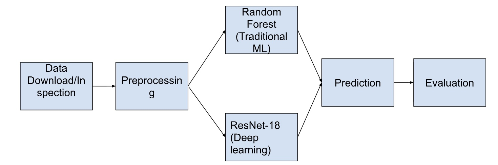
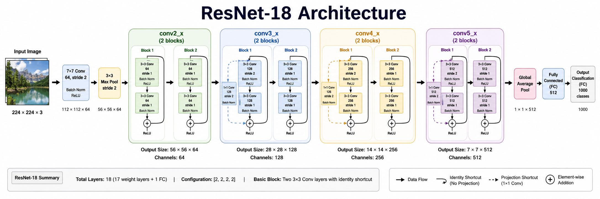
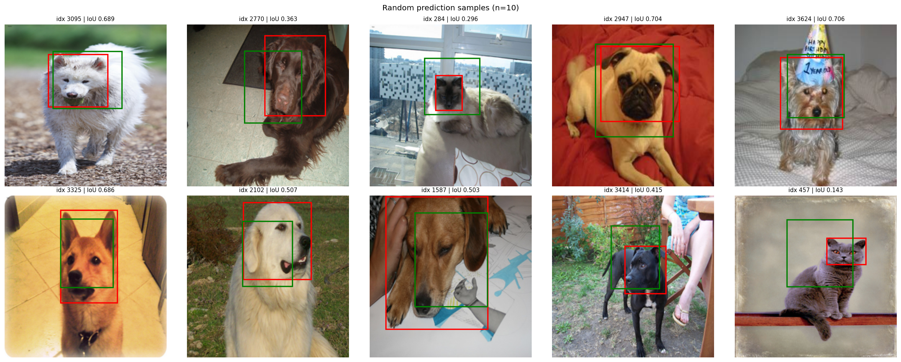
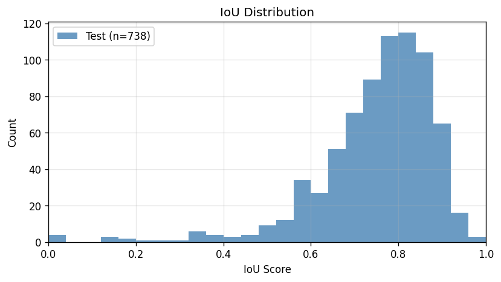
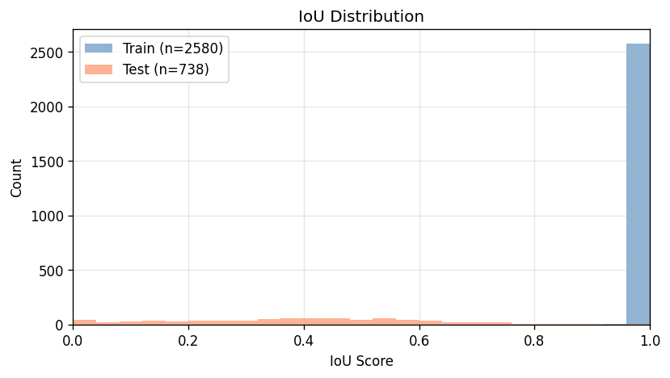

# End-to-End Object Localization with Deep Learning and Traditional ML

**Authors:** Charlie Wells, Gihwan (Finn) Jung, Aleksandre Khvadagadze

## Abstract
This project builds an end-to-end machine learning pipeline for object localization on pet images. The task is to predict bounding boxes for a single object in each image. We implemented and compared two approaches: (1) a deep learning ResNet-18 localization regressor and (2) a traditional machine learning baseline using PCA + ExtraTreesRegressor. The workflow includes data acquisition and preprocessing, exploratory analysis, model training, prediction export, and IoU-based evaluation. Final results show the deep learning model substantially outperforms the tree-ensemble baseline on held-out test data (test mean IoU 0.750 vs 0.354).

## Introduction
Object localization is a core computer vision problem with applications in robotics, autonomous systems, medical imaging, and intelligent content analysis. Unlike image classification, localization requires predicting precise spatial coordinates (bounding boxes), which introduces both representation and evaluation challenges.

In this project, we study supervised localization on pet images and compare a modern deep learning method against a classical machine learning baseline. The motivation is twofold: first, to implement a complete production-like ML workflow; second, to understand accuracy and generalization tradeoffs between model families under the same data and evaluation protocol.

This report is structured as follows. Method describes the pipeline and implementation details for preprocessing, exploratory analysis, features/targets, model architectures, and evaluation setup. Results reports model selection, hyperparameter tuning, and train/test IoU outcomes with discussion. Contribution clarifies each member's role. Course summary reflects key learning outcomes from the semester.

## Method
### 1. Experimental Pipeline Overview
The project pipeline is:
1. Collect raw images and XML annotations.
2. Preprocess into fixed-shape NumPy arrays and split indices.
3. Train models (deep learning and random forest baseline).
4. Generate predictions in a unified XML format.
5. Evaluate predictions with IoU metrics and visual diagnostics.

Flowchart artifact: `docs/ML_Final_Flowchart.jpg`.

### 2. Data Acquisition and Processing
Data processing is implemented in `data_preprocessing/preprocess_dataset.ipynb` (and utility script `data_preprocessing/preprocess_local_dataset.py`).

Key processing decisions:
- Images without valid annotations are excluded.
- Images are converted to RGB and resized to 224x224.
- Bounding boxes are transformed consistently with image resizing.
- Outputs are saved to:
  - `preprocessed_data/images.npy`
  - `preprocessed_data/bboxes.npy`
  - `preprocessed_data/train_indices.npy`
  - `preprocessed_data/val_indices.npy`
  - `preprocessed_data/test_indices.npy`

This makes the training/prediction pipeline deterministic and fast (no repeated XML parsing during training).

### Preprocessing decision explainations
We conducted an experiment comparing the different types of ways to preprocess the data and see how that affected the outcome, see [`data_preprocessing/preprocessing_comparison.ipynb`](../data_preprocessing/preprocessing_comparison.ipynb).

We considered a couple of options for preprocessing the images, but ultimately chose to scale the image data via [0,1] normalization to size 224x224 and use RGB format.

We did this for a few reasons:
1. There was no major difference in outcomes in our testing run between all the different preprocessing techniques, so we prioritized other things
2. simplicity and reliability: resizing images to 224x224x3 is really easy to do, and we knew that errors that would enevitably rise would not be from this, as the process is so simple.
3. 224x224 was a common image size from our research on the internet, and some quick calculations showed that it would be a reasonable size to train on

### 3. Data Visualization and EDA
EDA and visualization are performed in preprocessing and model notebooks/scripts:
- Visual checks of resized images and bounding boxes in preprocessing notebook.
- Sample qualitative prediction overlays in evaluation (`prediction_visualization.png`, `sample_bbox_train.png`).
- Distribution analysis using IoU histograms generated by `eval/evaluate_model.py`.

EDA-focused checks used in this project include:
- dataset shape and split counts,
- validity/range of box coordinates,
- qualitative correctness of bounding-box alignment after preprocessing,
- model error behavior via IoU distribution.

### 4. Features and Outputs
Input features:
- Pixel intensities from resized RGB images (224x224x3).
- For random forest, images are flattened and reduced via PCA.

Output target:
- Bounding box regression target in `(x, y, width, height)` for IoU evaluation.
- Deep learning internal representation uses normalized box regression output, then converts to evaluation format.

### 5. Machine Learning Methods
#### Deep Learning: ResNet-18 Regressor
Implemented in:
- `deep_learning/models/model_pretrained.py`
- training entrypoint: `deep_learning/train/train.py`
- grid-search configs: `deep_learning/train/configs/*.yaml`
- batch runner: `deep_learning/train/run_grid_search.ps1`

Approach:
- ResNet-18 backbone with regression head to predict 4 continuous box values.
- Pretrained backbone is used in training.
- Configurable hyperparameters for experiments: epochs, batch size, learning rate (with per-run config files).
- Loss: `smooth_l1_iou` (weighted combination of coordinate error and IoU-aware component).
- Optimizer: AdamW.
- Early stopping, fold checkpointing (`fold_n.pt`), and best-overall checkpoint tracking (`best.pt`).

ResNet-18 architecture used in this project:

#### Traditional ML: PCA + ExtraTreesRegressor
Implemented in:
- exploratory notebook: `machine_learning/random_forest.ipynb`
- runnable prediction script: `machine_learning/random_forest.py`

Approach:
- Flatten image vectors.
- PCA dimensionality reduction.
- Multi-output ExtraTreesRegressor predicts 4 box coordinates.

### 6. Model Selection / Hyperparameter Tuning
Both model families used cross-validation-aware model selection.

Deep learning selection (`deep_learning/train/train.py`):
- Hyperparameter grid search across 8 combinations:
  - `lr`: [1e-4, 1e-3]
  - `epochs`: [10, 20]
  - `batch_size`: [16, 32]
- For each combination, training used 5-fold cross-validation over the fixed training index pool (`preprocessed_data/train_indices.npy`).
- Fold-level outputs were saved (`fold_n.pt`, fold loss curves), along with run-level summaries (`cv_best_val_loss.png`, `fold_performance_comparison.png`).
- Model ranking criterion: lowest validation loss across folds, with cross-validation mean best validation loss used as the stability reference.
- Best deep learning run: `E20_B16_LR0001`
  - Best fold/epoch/loss: fold 1, epoch 17, val loss 0.207068
  - CV mean best val loss: 0.212002

Traditional ML (PCA + ExtraTrees) selection:
- Hyperparameter search was performed with randomized search and cross-validation in the random forest workflow.
- Search space:
  - `pca__n_components`: [100, 200, 300]
  - `rf__n_estimators`: [100, 200, 300]
  - `rf__max_depth`: [None, 10, 20, 30]
  - `rf__min_samples_leaf`: [1, 2, 4]
- Cross-validation: 3-fold, IoU-based scoring.
- Selected baseline setting: `pca=100`, `n_estimators=200`, `max_depth=None`, `min_samples_leaf=2`.

### 7. Evaluation Protocol
Unified evaluator: `eval/evaluate_model.py`

Evaluation metrics:
- Mean/median/std/min/max IoU
- Success rates at thresholds: IoU >= 0.25, 0.50, 0.75, 0.90
- Per-image IoU logs
- Visual diagnostics: IoU histogram, 10-sample prediction grid (`prediction_visualization.png`), and train representative overlay when available

Predictions are exported in a shared XML schema (for both model families), enabling apples-to-apples evaluation.

## Results
### 1. Final Train/Test Performance (IoU)
Evaluated on `preprocessed_data/bboxes.npy` using:
- `eval/predictions/resnet_18/train.xml`, `test.xml`
- `eval/predictions/random_forest/train.xml`, `test.xml`

| Model | Split | n | Mean IoU | Median IoU | IoU>=0.50 | IoU>=0.75 |
|---|---:|---:|---:|---:|---:|---:|
| Deep Learning (ResNet-18) | Train | 2580 | 0.793 | 0.821 | 97.6% | 74.0% |
| Deep Learning (ResNet-18) | Test | 738 | 0.750 | 0.777 | 95.7% | 58.9% |
| Extra Trees (PCA+ET) | Train | 2580 | 0.321 | 0.240 | 19.4% | 11.2% |
| Extra Trees (PCA+ET) | Test | 738 | 0.354 | 0.357 | 22.6% | 1.5% |

### 2. Discussion
Key findings:
- ResNet-18 strongly outperforms the Extra Trees baseline on both train and test splits.
- Deep model generalization gap is modest (0.793 train mean IoU -> 0.750 test mean IoU).
- Extra Trees remains substantially weaker than deep learning, with especially low high-IoU success on test (IoU>=0.75: 1.5%).

Interpretation:
- Convolutional representations are better suited than flattened + PCA features for spatial localization.
- Tree ensembles can model coarse structure but struggle to preserve the geometric detail required for high-IoU localization.

Best deep learning fold training curve:

Final model qualitative prediction visualization (10 random test samples):

Traditional ML (PCA + Extra Trees) qualitative prediction visualization:

### 3. Additional Evaluation Artifacts
Generated outputs are saved under:
- `eval/results/`
- Includes JSON reports, IoU distribution plots, and sample prediction visualizations.

Deep learning IoU distribution:

Traditional ML IoU distribution:

### 4. Future Work
1. Add checkpoint averaging or ensembling across CV folds for deep learning inference.
2. Try stronger localization architectures (e.g., feature pyramid heads or DETR-style models).
3. Improve augmentation policy (scale jitter, color jitter, random crop consistency constraints).
4. Report class-wise localization metrics to identify breed-specific failure modes.
5. Add calibration/error analysis for box size and center offsets separately.

## Contribution
Team contributions were distributed across the full pipeline:
- **Gihwan (Finn) Jung:** preprocessing pipeline design/implementation, evaluation tooling integration, end-to-end run orchestration, report/evidence integration.
- **Charlie Wells:** deep learning architecture/training pipeline implementation (ResNet-based regressor, config-driven training, checkpointing), prediction/export workflow.
- **Aleksandre Khvadagadze:** traditional ML baseline (PCA + Extra Trees), hyperparameter tuning with cross-validation, baseline analysis and comparative discussion.

All members contributed to debugging, experiment iteration, and deliverable preparation.

## Conclusion
This project delivered a complete object-localization pipeline from annotation parsing through model evaluation. Under a shared preprocessing and IoU-based evaluation protocol, the deep learning ResNet-18 regressor outperformed the traditional PCA + Extra Trees baseline by a wide margin on held-out test data. The comparison highlights that convolutional feature learning is substantially more effective than handcrafted flattened-feature pipelines for precise spatial localization, while also reinforcing the importance of reproducible splits, consistent target formatting, and unified evaluation tooling in end-to-end ML projects.

## Course Summary
This project consolidated core course concepts into a single applied pipeline:
- converting problem definitions into measurable ML objectives,
- designing reproducible preprocessing and train/val/test splits,
- comparing model classes under unified metrics,
- diagnosing overfitting/underfitting using both scalar metrics and plots,
- building practical ML tooling (configs, scripts, evaluation reports) rather than only notebook experiments.

The most important learning outcome was that model quality depends not only on algorithm choice, but on rigorous data handling, consistent evaluation, and reproducible experiment design.

## References
1. He, K., Zhang, X., Ren, S., & Sun, J. (2016). Deep Residual Learning for Image Recognition. CVPR.
2. Geurts, P., Ernst, D., & Wehenkel, L. (2006). Extremely randomized trees. Machine Learning, 63(1), 3-42.
3. Pedregosa, F., et al. (2011). Scikit-learn: Machine Learning in Python. JMLR.
4. Oxford-IIIT Pet Dataset (Parkhi et al., 2012), dataset used for pet image/annotation localization tasks.
