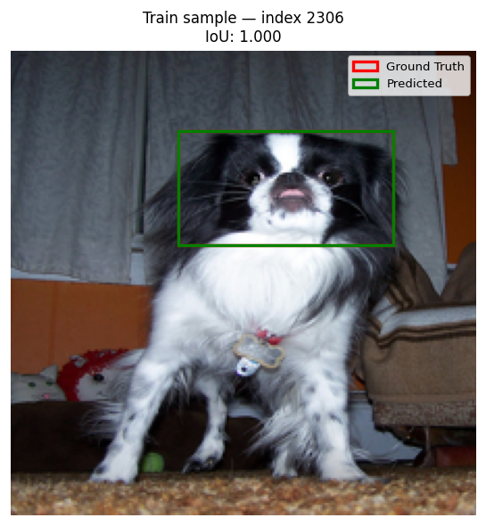

# Model Evaluation Reports
_Updated: 2026-05-02 16:27:26_

---

## 2026-05-02 16:27:26 — random_forest

| Split | Mean IoU | Median IoU | % preds ≥ IoU 0.50 | % preds ≥ IoU 0.75 | n |
|-------|----------|------------|--------------------|--------------------|-|
| **Train** | 1.000 | 1.000 | 100.0% | 100.0% | 2580 |
| **Test** | 0.392 | 0.400 | 32.4% | 3.5% | 738 |

**Hyperparams:** n_estimators=200  ·  max_depth=None  ·  min_samples_leaf=1  ·  pca_n_components=200

| Train sample | Test sample |
|---|---|
|  |  |

---
