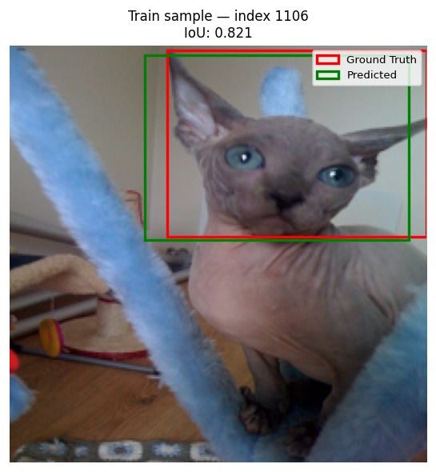

# Model Evaluation Reports
_Updated: 2026-05-02 16:04:13_

---

## 2026-05-02 16:04:13 — deep_learning_model

| Split | Mean IoU | Median IoU | % preds ≥ IoU 0.50 | % preds ≥ IoU 0.75 | n |
|-------|----------|------------|--------------------|--------------------|-|
| **Train** | 0.793 | 0.821 | 97.6% | 74.0% | 2580 |
| **Test** | 0.750 | 0.777 | 95.7% | 58.9% | 738 |

| Train sample | Test sample |
|---|---|
|  |  |

---
